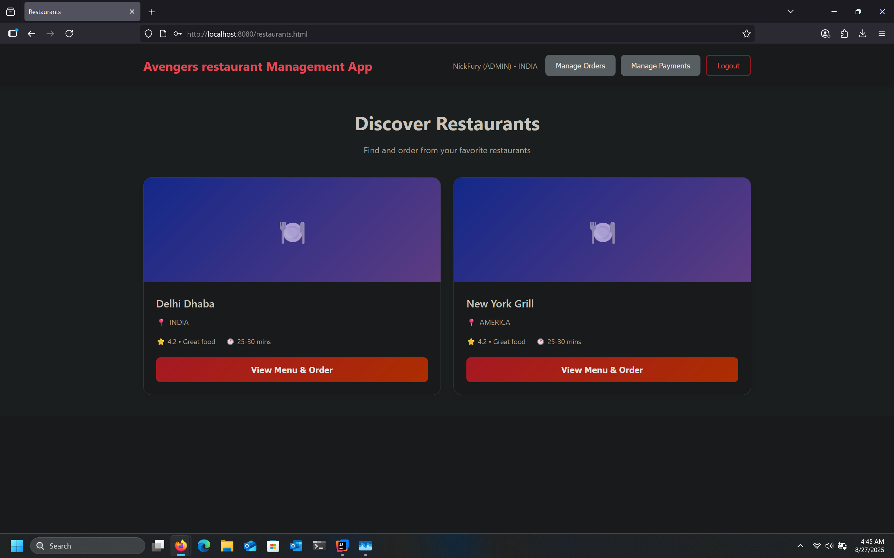
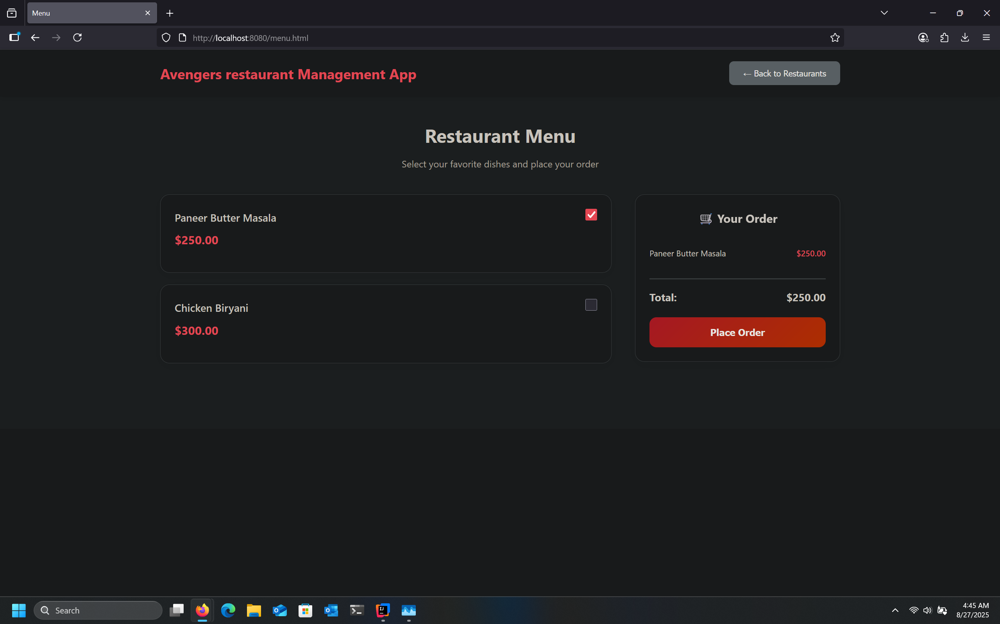

# 🍴 Slooze Food Ordering System (SDE Assignment)

A Spring Boot based food ordering backend built as part of an SDE
take-home assignment.\
It demonstrates authentication with JWT, role-based and country-based
access control, and CRUD APIs for restaurants, menus, orders, and
payments.

------------------------------------------------------------------------

demo video available at: https://drive.google.com/file/d/1BBDsWbDznjCBaWbjQB5Ttlv4qypvu8HW/view?usp=sharing

------------------------------------------------------------------------

## ⚡ Features

-   **Authentication & Authorization**
    -   JWT-based login (`/auth`)
    -   Role-based restrictions (`ADMIN`, `MANAGER`, `MEMBER`)
    -   Country-level access checks (users can only interact with
        restaurants in their country unless ADMIN)
-   **Restaurant Management**
    -   View restaurants and menus
-   **Order Lifecycle**
    -   Create order
    -   Checkout order
    -   Cancel order
-   **Payments**
    -   Payments automatically created with orders
    -   Payment status updates on checkout/cancel

------------------------------------------------------------------------

## 🛠️ Tech Stack

-   **Backend:** Spring Boot 3, Spring Security (JWT)
-   **Database:** PostgreSQL
-   **Build Tool:** Maven
-   **Other:** JPA/Hibernate, Lombok

------------------------------------------------------------------------

## 🚀 Getting Started

### 1️⃣ Clone the repository

``` bash
git clone https://github.com/Jainil2004/restaurantAssignment.git
cd restaurantAssignment
```

### 2️⃣ Create the database

Make sure PostgreSQL is running, then create a database named `slooze`:

``` sql
CREATE DATABASE slooze;
```

### 3️⃣ Configure database credentials (if needed)

By default, the app expects:

``` yaml
spring:
  datasource:
    url: jdbc:postgresql://localhost:5432/slooze
    username: postgres
    password: postgres
```

Update **`application.yml`** if your local Postgres uses different
username/password.

### 4️⃣ Start the application

Run with Maven:

``` bash
mvn spring-boot:run
```

Or from your IDE, run the `SdeApplication` main class.\
On successful startup, the app will be available at:

    http://localhost:8080

### 5️⃣ Seed sample data

On first run, Spring will auto-run `data.sql` and insert sample users,
restaurants, and menu items.\
👉 All users have default password: `help`

### 6️⃣ Hit localhost:8080/ and use the application

-   Use the application frontend to traverse and perform various activities
-   Screenshots for the various pages are provided below 
-   Various helpful information are also present for understanding the system.

------------------------------------------------------------------------

## 📸 Screenshots

### Login Page


### Restaurant List


### Order Checkout

